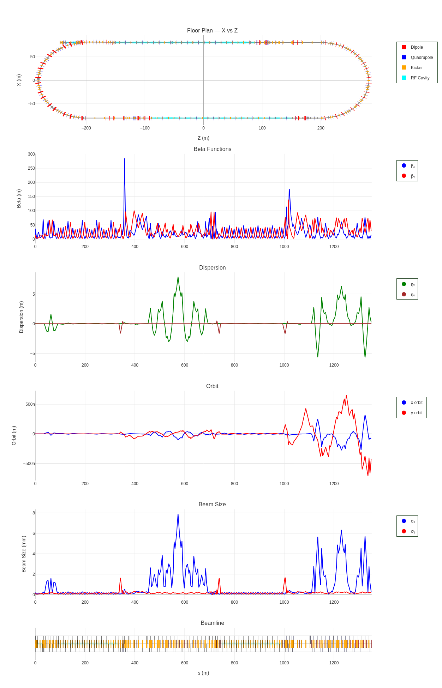
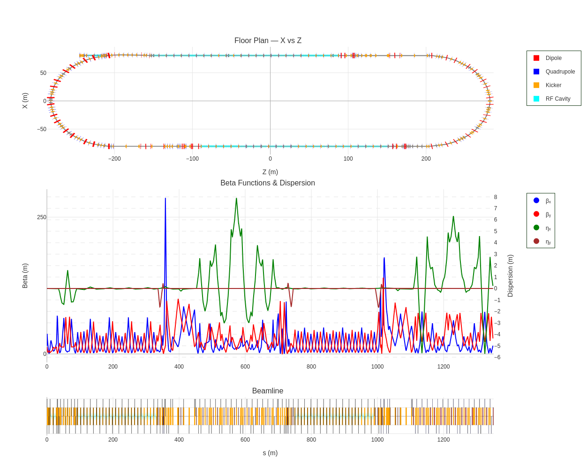
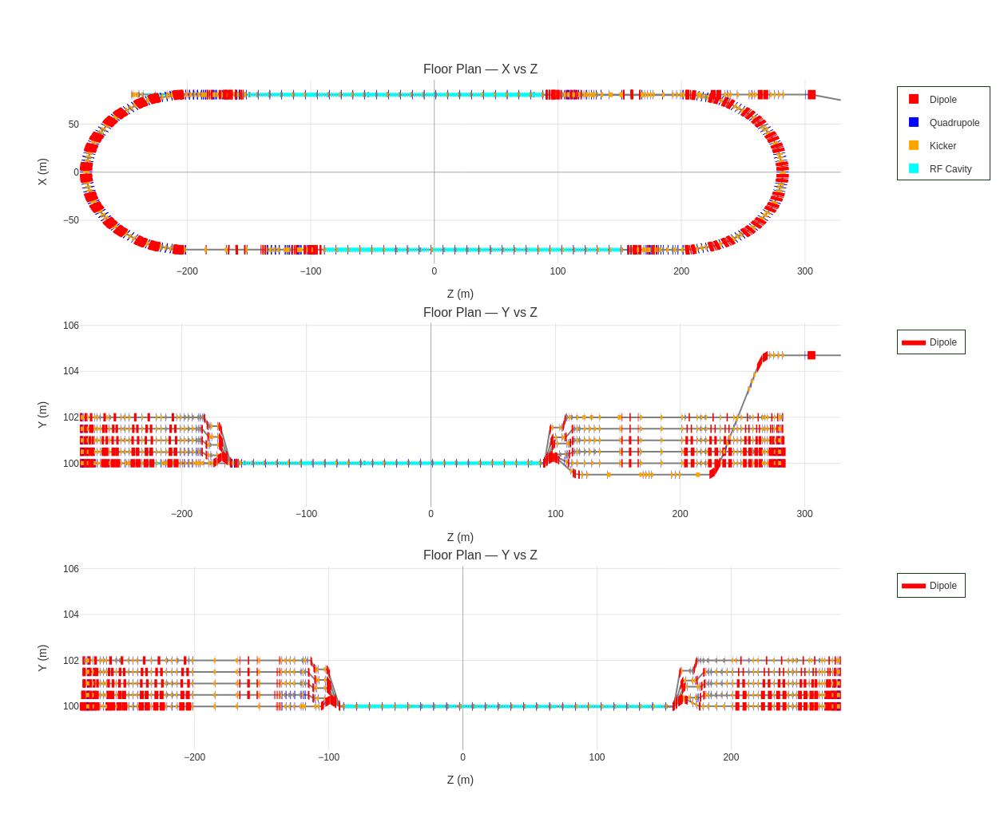

# Examples

The following examples are generated from the CEBAF lattice at Jefferson Lab using the ELEGANT backend. The same plots can be reproduced identically using the Tao/Bmad backend with the same lattice.

All plots are fully interactive — you can pan, zoom, hover over any element or data point, toggle traces on and off via the legend, and isolate individual panels.

---

## CEBAF 1-Pass — Full Panel Stack

A complete optics dashboard for one pass through CEBAF, showing the floor plan followed by beta functions, dispersion, orbit, beam size, and the beamline bar.

[Open interactive plot](assets/CEBAF_1Pass_full.html){ .md-button }

---

## CEBAF 1-Pass — Compact View

The same one-pass lattice with a reduced panel set: floor plan, combined beta functions and dispersion on dual y-axes, and the beamline bar. Useful for a quick overview without the clutter of orbit and beam size panels.

[Open interactive plot](assets/CEBAF_1Pass.html){ .md-button }

---

## CEBAF Floor Plan — Three Projections

Floor plan only, showing all three spatial projections: X-Z (top-down view of the full racetrack) and both Y-Z views of the recirculating arcs. This layout is useful for verifying the 3D geometry of the beamline.

[Open interactive plot](assets/CEBAF_floorplan.html){ .md-button }
