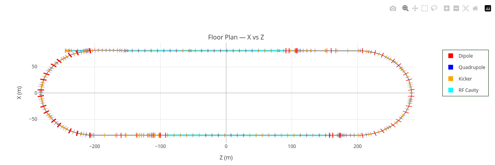
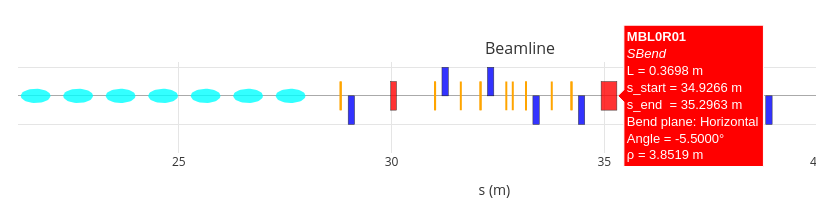
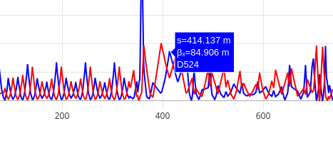
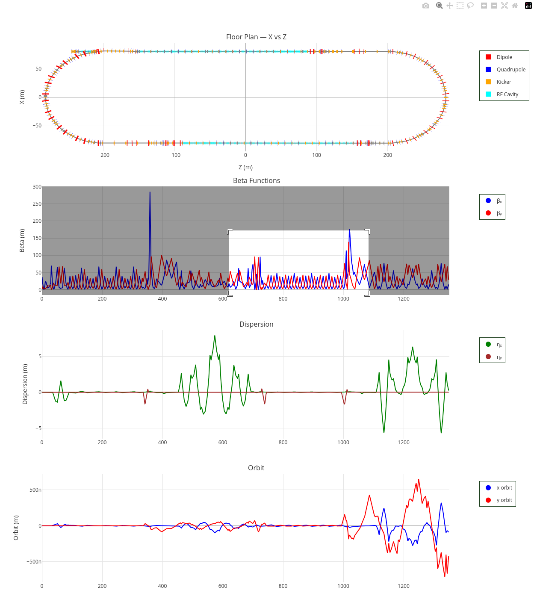
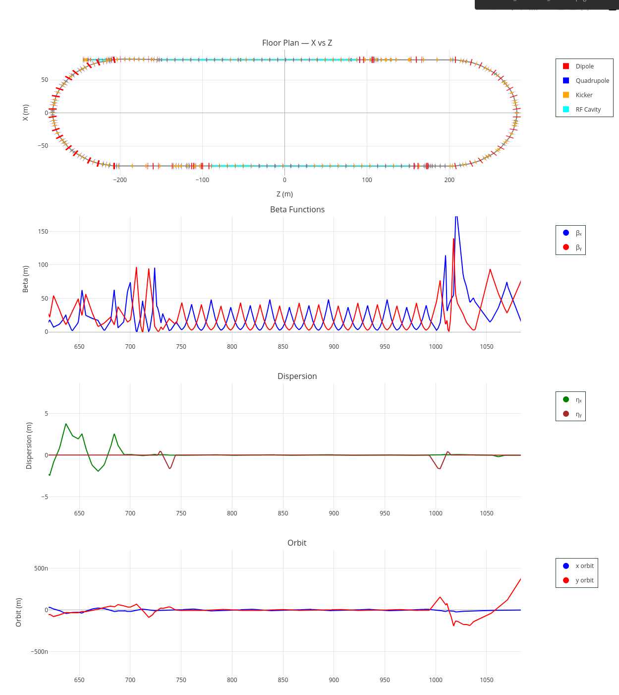

# Interactive Plots

RanOptics outputs a self-contained HTML file powered by [Plotly](https://plotly.com/). No server, no extra software — just open the file in any browser. All panels in the dashboard are linked, meaning zoom and pan operations on any panel update the s-axis range across the entire plot simultaneously.

---

## The Toolbar

When you hover over any panel, the Plotly toolbar appears in the top-right corner of that panel.

From left to right the buttons are:

| Icon | Action |
|---|---|
| Camera | Save the current view as a PNG |
| Magnifying glass | Zoom mode (default) |
| Plus | Pan mode — click and drag to pan |
| Box select | Select a rectangular region to zoom into |
| Lasso | Freehand selection |
| Zoom in / Zoom out | Step zoom in or out |
| Autoscale | Fit all data in view |
| Reset axes | Reset to the original full view |
| Toggle spike lines | Show crosshair lines on hover |

---

## Hovering over Elements

Hovering over any element marker in the beamline bar or floor plan shows a popup with that element's properties — name, type, length, s-position, and element-specific parameters such as bend angle and bending radius.

In the example above, hovering over a dipole in the beamline bar shows its name (`MBL0R01`), type (`SBend`), length, entry and exit s-positions, bend plane, angle, and bending radius.

---

## Hovering over Twiss Curves

Hovering over any curve in an optics panel shows the s-position and value at that point, along with the element name at that location.

---

## Zooming In

To zoom into a region of interest, click and drag a selection box over the area in any panel. The shaded region shows what will be zoomed into.

When you release, all panels update simultaneously to show the selected s-range.

To reset back to the full view, double-click anywhere on the plot or click the **Reset axes** button in the toolbar.

---

## Legend Interaction

Click any legend entry to toggle that trace on or off. Double-click a legend entry to isolate it — all other traces are hidden. Double-click again to restore all traces.

---

## Saving a Static Image

Click the **camera icon** in the toolbar to save a PNG of the current view directly from the browser. This captures whatever zoom level and trace visibility you currently have set.
